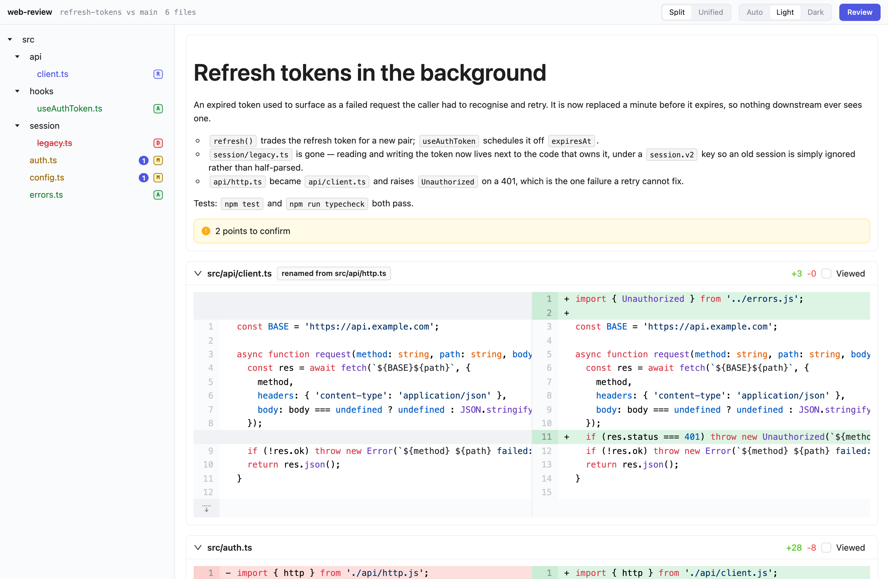
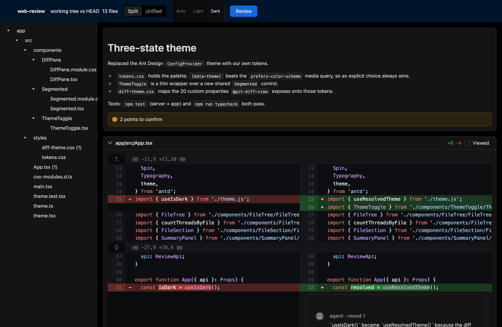
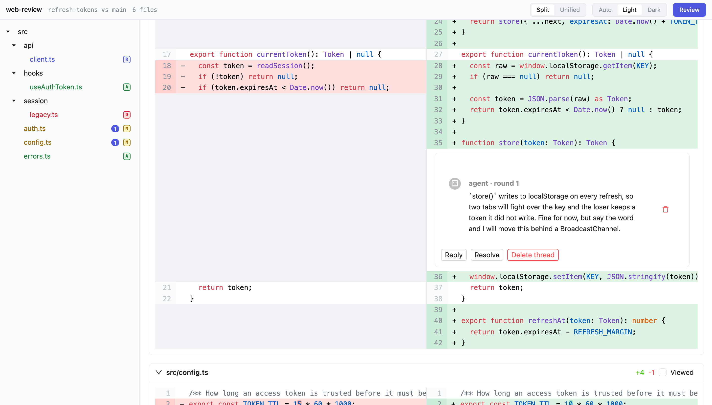

# web-review

The simplest way to review the code your agent just wrote.

Your agent finishes its work and opens a real "Files changed" page in your
browser. You read it like a pull request, comment on the lines you care about,
and hit **Review**. The agent gets your comments and gets back to work.

Everything runs on your machine. No account, no service, nothing to configure.

|                       Light                       |                      Dark                       |
| :-----------------------------------------------: | :---------------------------------------------: |
|  |  |

## Install

One command, whichever agent you use:

```bash
npx skills add jsellam/web-review -g
```

That's it. Claude Code, Codex, Cursor, Gemini CLI and seventy-odd others are
supported — [`skills`](https://github.com/vercel-labs/skills) asks which ones
you want and installs to each. Drop the `-g` to scope it to the current
repository instead.

There is nothing to build and no `npm install`: the whole tool is one
self-contained file that needs Node `>=18.17` and nothing else.

## Using it

You don't run anything. The agent opens the review itself, when it matters:
after a batch of edits, and before it commits or pushes. If it forgets, ask:

> review your changes

Your browser opens on the diff. From there it is GitHub, with the parts that
matter: file tree, split or unified, syntax highlighting, *Viewed* checkboxes,
and comments you attach to a line by clicking it. When you're done, **Review**
lets you approve, request changes, or just leave notes.

The agent is blocked on you the whole time, so nothing lands behind your back.
Take five minutes or take an hour — it waits, and picks up exactly where you
left it.

## Why it beats reading the diff in your terminal

**The agent goes first.** Before you look at anything, it writes what it did and
why, and pins notes to the lines it isn't sure about — a hard-coded value, debt
it took on, a refactor it isn't certain you want. You start reading with
context instead of a bare diff.



**Your comments land on the line.** No describing a file and a line number in
chat and hoping the agent finds it.

**It's a conversation, not a one-shot.** You comment, the agent fixes it or
pushes back with its reasoning, and the next round shows your original comment
right next to its reply — even if the code moved in between. You keep going
until it's right.

**Nothing leaves your machine.** Your code, your comments, your review — all
local.

## Security

The server binds to `127.0.0.1` only, on a port chosen by the OS, and every
request must carry a random per-session token (embedded in the URL that gets
opened, and required on every API call). It also validates the `Host` header
against `127.0.0.1:<port>` or `localhost:<port>` and rejects anything else.

That last check matters specifically because of DNS rebinding: without it, any
tab already open in your browser could point its own hostname at `127.0.0.1`
and, once your browser resolves it, read your repository through this API — the
loopback binding alone doesn't stop that, because the attacker's page and the
review server would both be reachable at the same address. The `Host` check
closes that gap.

Review state lives in git's own directory (`git rev-parse --absolute-git-dir`,
so `.git/web-review/` in an ordinary checkout and `.git/worktrees/<name>/web-review/`
in a worktree), never in the working tree — a file at the repo root would show
up inside the diff being reviewed.

## Development

```bash
npm install
npm test              # vitest run — server (node) + app (jsdom)
npm run typecheck
npm run build         # vite build (app/dist) + esbuild bundle (dist/web-review.mjs)
```

`dist/` and `app/dist/` are committed; CI fails if you changed source without
rebuilding. [`AGENTS.md`](AGENTS.md) is the contract the agent follows, if you
want to see or change what it does.

## License

[MIT](LICENSE)
